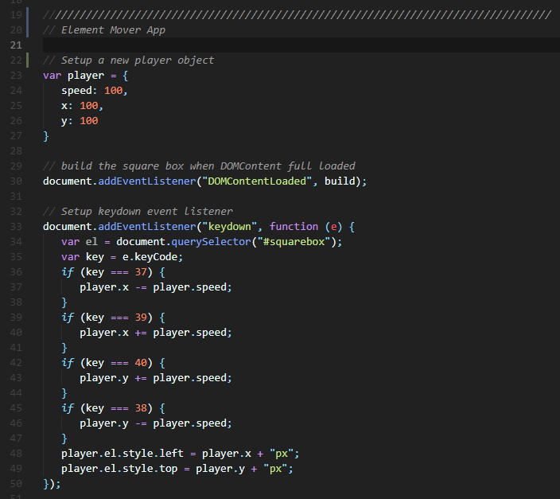
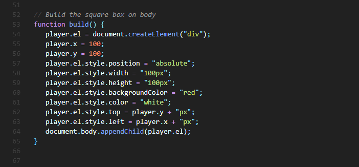
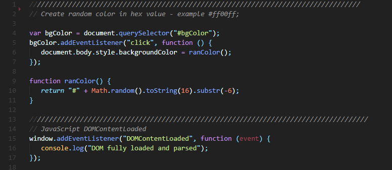

# Element Mover
A simple Element Mover - This small app is just a simple test on the key press tracking and element moving code.

## Code Snippet
### Setup new player object

### Create new Element (The Red Box) on document body

### This block is just to test on random color code

## Load the app
[click to run](https://monksedo.github.io/ElementMover/)

## Screenshot

